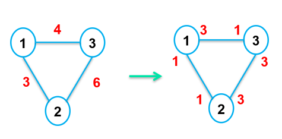
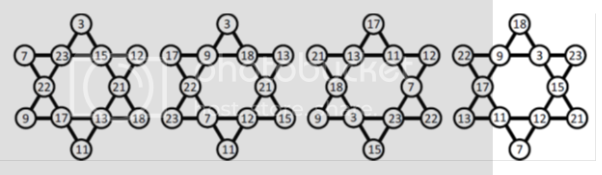

CONTEST 3
# A
Cho hai số nguyên K và S. Nhiệm vụ của bạn là hãy đếm số bộ ba (X, Y, Z) khác nhau với 0 ≤ X, Y, Z ≤ K và thỏa mãn X + Y + Z = S?

**Input:**

Gồm 2 số nguyên K và S (2 ≤ K ≤ 2500, 0 ≤ S ≤ 3K).

**Output:** 

In ra số lượng bộ 3 số thỏa mãn.

**Test ví dụ:**

|Input:|Output|
| - | - |
|2 2|6|
|6 18|1|

Giải thích test 1: Các bộ số thỏa mãn là (0, 0, 2), (0, 2, 0), (2, 0, 0), (0, 1, 1), (1, 0, 1) và (1, 1, 0).

Giới hạn thời gian: 2s

Giới hạn bộ nhớ: 524288 Kb
# B
Bạn có một dãy số không giảm (các phần tử được sắp xếp tăng dần hoặc bằng nhau) a1​,a2​,…,aN​. Bạn muốn phá hủy tính chất không giảm này bằng cách sử dụng một phép XOR hai phần tử kề nhau.

Trong một bước, bạn có thể chọn hai phần tử liền kề trong dãy, ví dụ x và y. Xóa chúng khỏi dãy số và chèn vào vị trí đó phần tử mới có giá trị bằng x XOR y. Độ dài của dãy số giảm đi một sau mỗi thao tác. Thao tác này không thể thực hiện khi chỉ còn một phần tử.

**Ví dụ:** Dãy số ban đầu là [1, 5, 6, 9]. Nếu chọn 5 và 6, thay thế chúng bằng 5 XOR 6 = 3, ta thu được [1, 3, 9].

**Yêu cầu:** Tìm số bước (thao tác) tối thiểu cần thiết để làm cho dãy số không còn là dãy không giảm nữa. Nếu dãy số vẫn luôn không giảm mặc dù bạn thao tác như thế nào, hãy in ra -1.

**Input**

Dòng đầu tiên chứa một số nguyên N (2 ≤ N ≤ 105), là độ dài ban đầu của dãy số.

Dòng thứ hai chứa N số nguyên a1​,a2​,…,aN​ (1 ≤ ai​ ≤ 109). Input đảm bảo rằng ai​ ≤ ai+1​.

**Output**

In ra một số nguyên duy nhất là số bước tối thiểu cần thiết. Nếu không có đáp án, hãy in -1.

**Test ví dụ:**

|Input|Output|
| - | - |
|
4

2 5 6 8
|1|
|
3

1 2 3
|-1|
|
4

11 22 71 92
|2|

Giải thích test 1: Chọn (2, 5), ta được dãy số mới sau 1 bước là (7, 6, 8).

Giới hạn thời gian: 2s

Giới hạn bộ nhớ: 524288 Kb
# C
Cho xâu S chỉ gồm các kí tự thường. Nhiệm vụ của bạn là hãy tìm xâu thứ K trong tất cả các xâu được tạo ra là hoán vị của xâu S đã cho.

**Input:** 

Dữ liệu đầu vào gồm xâu S và số nguyên K. Xâu S có độ dài không quá 8 kí tự.

Input đảm bảo đáp án có tồn tại.

**Output:** 

Hãy in ra xâu tìm được.

**Test ví dụ:**

|Input:|Output:|
| - | - |
|aab 2|aba|
|baba 1|aabb|

Giới hạn thời gian: 2s

Giới hạn bộ nhớ: 524288 Kb

# D
Cho tập N điểm trong không gian hai chiều Oxy. Nhiệm vụ của bạn là xóa đi một điểm sao cho khoảng cách lớn nhất giữa hai điểm bất kì của các điểm còn lại là nhỏ nhất. Khoảng cách giữa hai điểm A và B được tính theo công thức Manhattan:

dist(A, B) = |xA – xB| + |yA – yB|

Hãy in ra giá trị khoảng cách lớn nhất nhỏ nhất có thể tìm được.

**Input:**

Dòng đầu nhập số nguyên N là số lượng các điểm (3 ≤ N ≤ 100000).

N dòng tiếp theo, mỗi dòng nhập hai số nguyên Xi và Yi mô tả tọa độ của một điểm.

(0 ≤ Xi, Yi ≤ 109).

**Output:**\
Hãy in ra đáp án trên một dòng.

**Test ví dụ:**

|Input|Output|
| - | - |
|
4

3 10

5 15

10 2

4 4
|12|
# E
Alice và Bob đang chơi một trò chơi như sau:

Có 2 đống sỏi, có lần lượt X và Y viên sỏi. Lần lượt mỗi người chơi sẽ lấy đi 2\*A viên sỏi từ một đống nào đó, rồi trả lại A viên sỏi cho đống còn lại. Ai không thực hiện được bước đi sẽ là người thua cuộc.

2 bạn chơi lần lượt, Alice là người đi trước. Các bạn hãy xác định xem ai sẽ là người chiến thắng nếu như cả hai đều có chiến thuật tối ưu?

**Input:**

Dữ liệu đầu vào gồm hai số nguyên X và Y (0 ≤ X, Y ≤ 1018).

**Output:** 

Với mỗi test, in ra “Alice” hoặc “Bob” là người chiến thắng.

**Test ví dụ:**

|Input|Output|
| - | - |
|2 1|Bob|
|6 0|Alice|
|0 0|Bob|
|10 5|Alice|

Giải thích test 1: Alice buộc phải lấy 2 viên sỏi, (2, 1) à (0, 2). Tiếp theo Bob lấy 2 viên sỏi, chuyển trạng thái từ (0, 2) à (1, 0). Alice không thể đi tiếp được nữa và anh ấy thua cuộc.

Giới hạn thời gian: 2s

Giới hạn bộ nhớ: 524288 Kb
# F
Alice quan sát sao trên trời. Có N ngôi sao, ngôi sao thứ i có độ sáng A[i]. Với Alice, N ngôi sao tạo thành một chòm sao nếu chúng thỏa mãn các điều kiện sau:

- Với mọi i, giá trị A[i] là số nguyên nằm trong đoạn [Li, Ri].
- A[1] + A[2] + … + A[N] ≤ M
- GCD(A[1], A[2], …, A[N]) = 1

Alice muốn tính số lượng trường hợp các ngôi sao tạo thành chòm sao. Hãy giúp Alice tính toán giá trị này. Do kết quả có thể rất lớn, in đáp án với modulo 998244353.

**Input:**

Dòng đầu nhập hai số nguyên N và M (2 ≤ N ≤ 50, 1 ≤ M ≤ 100000).

N dòng tiếp theo, mỗi dòng nhập hai số nguyên Li và Ri (1 ≤ Li ≤ Ri ≤ M).

**Output:**

In số lượng trường hợp các ngôi sao có thể tạo thành chòm sao với modulo 998244353.

**Test ví dụ:**

|Input|Output|
| - | - |
|
2 4

1 3

1 2
|4|
|
4 50

1 20

1 20

1 20

1 20
|113623|

Giải thích test: Có 4 trường hợp thỏa mãn các ngôi sao tạo thành chòm sao:

[1, 1], [1, 2], [2, 1], [3, 1]

Giới hạn thời gian: 2s

Giới hạn bộ nhớ: 524288 Kb
# G
Cho dãy số A[] có N phần tử. Có 2 loại truy vấn như sau:

1 u val: Cập nhật A[u] = val

2 u v X: Hãy in ra giá trị phần tử nhỏ nhất trong đoạn [u, v] mà có giá trị lớn hơn X? Nếu không tồn tại số nào, hãy in ra -1.

**Input:** 

Dòng đầu tiên gồm 2 số nguyên, số lượng phần tử N và số lượng truy vấn M (N, M ≤ 100000).

Dòng tiếp theo gồm N số nguyên mô tả dãy số A[i] (0 ≤ A[i] ≤ 109).

M dòng tiếp, mỗi dòng gồm 1 truy vấn.

**Output:** 

Với mỗi truy vấn loại 2, hãy in ra đáp án tìm được trên một dòng.

**Test ví dụ:**

|Input:|Output:|
| - | - |
|
5 4

1 2 3 4 5

2 2 5 2

1 3 1

2 2 5 2

2 1 5 5
|
3

4

-1
|

Giới hạn thời gian: 2s

Giới hạn bộ nhớ: 524288 Kb
# H
Trang trại của nông dân John được thắp sáng bởi hệ thống chiếu sáng với N cột điện. Để cung cấp điện cho hệ thống, anh ấy đã kết nối M đường dây điện trực tiếp giữa một số cột. Mỗi đường dây điện có khả năng chịu tải được W[i] bóng đèn. Người thợ điện đã lắp đúng và đủ W[i] bóng đèn một cách đều đặn trên mỗi đường dây.

Tuy nhiên, sau một thời gian, nông dân John thấy cách bố trí đèn như vậy không được đẹp cho lắm. Anh ấy muốn các bóng đèn chỉ tập trung ở phía cột đèn mà thôi. Trên mỗi đường dây, các bóng đèn trước kia phân bố đều trên đường dây, nay anh sẽ dồn về phía 2 cột đèn. Mục tiêu của anh là số lượng bóng đèn ở tất cả các cột phải **bằng nhau** và là **nhiều nhất có thể**. Vì thế, một số bóng đèn thừa sẽ phải tháo bỏ.

Các bạn hãy tính giúp xem anh John cần phải loại bỏ ít nhất bao nhiêu bóng đèn?

**Input:** 

Dòng đầu tiên chứa hai số nguyên N và M (N ≤ 200, M ≤ 500).

M dòng tiếp theo, mỗi dòng gồm 3 số nguyên u, v, W (1 ≤ u, v ≤ N, W ≤ 10000) cho biết một đường dây giữa cột thứ u và v đã có W bóng đèn. Input đảm bảo giữa 2 cột điện chỉ có 1 đường dây duy nhất.

**Output:** 

In ra một số nguyên là số bóng đèn ít nhất cần được loại bỏ.

**Test ví dụ:**

|Input:|Output:|
| - | - |
|
3 3

1 2 3

1 3 4

2 3 6
|1|
|
5 4

1 2 3

1 5 3

2 3 3

2 4 10
|4|

Giải thích test 1: Loại bỏ 1 bóng đèn trên đường dây 1-2.

Giới hạn thời gian: 2s

Giới hạn bộ nhớ: 524288 Kb
# I
Hexagram được định nghĩa là một ngôi sao 6 cánh đặc biệt. Mỗi giao điểm trong ngôi sao ghi một số nguyên dương sao cho tổng các số trong mỗi cạnh đều bằng nhau.

Ví dụ với dãy số: 3 17 15 18 11 22 12 23 21 7 9 13

Thì ta sẽ có 4 cách sắp xếp các số trên vào ngôi sao là:

Bài toán đặt ra là cho trước dãy 12 số nguyên. Hãy đếm số cách xếp các số đó vào ngôi sao sáu cạnh để được dạng Hexagram như mô tả trên.

Chú ý: Không xét các trường hợp là xoay của nhau hoặc lấy đối xứng.

**Input**

Dòng đầu ghi số bộ test T (T <= 100).

Mỗi bộ test ghi trên một dòng 12 số nguyên dương, mỗi số cách nhau một khoảng trống. Các số đều được đảm bảo nhỏ hơn 1000000.

**Output**

Với mỗi bộ test, in ra màn hình số cách xếp các số trên để tạo thành HEXAGRAM như mô tả trên. 

**Ví dụ:**

|**Input**|**Output**|
| - | - |
|
2

3 17 15 18 11 22 12 23 21 7 9 13

1 2 3 4 5 6 7 8 9 10 11 13
|
4

0
|

Giới hạn thời gian: 2s

Giới hạn bộ nhớ: 524288 Kb
# J
Trong chuyến du lịch, các bạn nam xung phong xách các túi hành lý cho cả đoàn. Tất nhiên mỗi người có thể xách được tối đa 2 túi nếu tổng trọng lượng 2 túi đó không vượt quá “ngưỡng” cho phép.

Hãy tính xem cần bao nhiêu bạn nam để mang được hết hành lý cho chuyến đi.

**Input**

Dòng đầu ghi 2 số N và C lần lượt là số túi xách và giá trị ngưỡng có thể xách được của một người. (1 ≤ N ≤ 105; 1 ≤ C ≤ 109)

Dòng thứ 2 ghi N số lần lượt là trọng lượng của từng túi. Biết rằng các trọng lượng đều nguyên dương và không quá C.  

**Output**

Ghi ra số bạn nam tối thiểu tính được.

**Ví dụ**

|**Input**|**Output**|
| - | - |
|
4 100 44 35 66 67

 
|3|
|
1 10 7

 
|1|
|
3 12 10 5 6

 
|2|

Giới hạn thời gian: 1s

Giới hạn bộ nhớ: 200000 Kb

